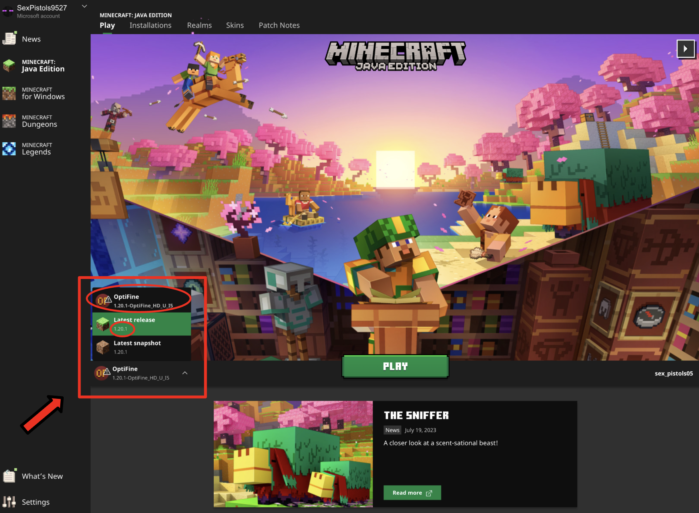

## &#x237e; GOAL
- [x] intriguing places to wander around when bored
- [x] build a large enough map with interesting adventure settings so I can forget what I had built and join the world as a player, also for other players to play
- [x] experience creating

## &#x237e; Shaders
**1) Download [Java](https://www.oracle.com/java/technologies/downloads/#jdk17-mac)**  
- *`Java 17` is required at least*
- *select `ARM64 DMG Installer` for macOS*
- *open and install `->` if software is not identify:*
    - go to settings 
    - privacy & security
    - scroll down to find security pop-ups, to mannually release system block
    - remember to close the minecraft and its launcher during installing
- *for myself, xirongcao0921 is the outlook email used for minecraft purchase, just in case I forget.*
 

**2) [OptiFine](https://optifine.net/downloads.php)** 
- *A `Mod` for customizaed minecraft blocks*  
    - click on (Mirror), and download
    - open .jar will directly download it for the minecraft folder (/usr/library/AppSupport/minecraft on Mac)
- *the version of OptiFine must match the version of minecraft you are playing*
<!-- alignment problem -->
<!--  -->
<!-- 

 -->

 

**3) [Shader list](https://modrinth.com/shaders)** 
- *actual files that customized minecraft blocks into different style*  
    - shader version not necessarily have to be compactible with minecraft version 100%, not like OptiFine
    - I am use [Complementary Unbound r5](https://modrinth.com/shader/complementary-unbound/version/latest), [BSL Shaders](https://modrinth.com/shader/bsl-shaders/versions)  some don't work mac java version. Kappa is the one I want to try, but not compatible.
    - shader file must be zipped, rezip it if macOS unzip after downloading, right click compress
- *Complementary-unbound basic setting*  
    - visual style: `unbound`  
    - RP support: `Integrated PBR+`
    - lighting multipliers "ON" (sunrise/sunset/noon): `RGB: 1` | `Intensity: 0.9`
    - Atmosphere multipliers "ON"
        - Atmosphere color multipliers (sunrise/sunset/noon): `RGB=0.85`
        - clouds style: `unbound` | clouds shadow: `ON`
        - night nebulae: `ON` (maybe turn it off for more realistic experiment)
        - sun/moon style: `unbound`
        - sun/moon angle: `-40 unbound`
        - weather texture: `opacity=85`
        - water & water caustic style: `unbound`
        - water surface color: `RGB=0.85`
        - water brighter shallow/cave water: `OFF`
    - material: `Integrated PBR+` -> Generated Normal: `ON` | Coated Textures: `ON`
    - other: world outline `ON`
- *render setting*  
    - the white blurring effect I think is because the rendering blocks are not enough
    - when water touch some blocks, it will have white burring effect surrounding, but didn't see it in the bsl shaders, figure it out later on setting

**4) Minecraft UI**
- *select `OptiFine` enter minecraft at the launcher UI*  
    `->`select option `->` video setting `->` shaders `->` then click shaders folder `->` drag the zip files to this folder `->` click on one shaders if the shader option is working then it's working `->` further adjust light and other components by clicking shader options

## &#x232d; My Buildings 

**`+`** *Adventure Starting Point: ByTheSea (xyz: -4282 / 65 / -5982)*

**`+`** *Red Pool (night): ByTheSea (xyz: 2129.073 / 62 / -592.904), - inspired by [this](https://www.youtube.com/watch?v=h7HG0VPufQE)*  

**`+`** *Sorting Room: ByTheSea*  

**`+`** *Smelting Room: ByTheSea*  

**`+`** *Cave View: ByTheSea*

**`+`** *Mine Entrance: ByTheSea - copied from [disruptive builds](https://www.youtube.com/watch?v=LIdEEKGeM3I)*  

**`+`** *Forest Entanece: ByTheSea (1934.070 / 63 / -2813.602) - copied from [disruptive builds](https://www.youtube.com/watch?v=Sjd9qLXC8fs&t=271s)*  

**`+`** *Red Build: ByTheSea (inspired by stranger things)*  

**`+`** *Top View: ByTheSea*  

## To-Do 
- [ ] defense/attack Buildings
    - [resource](https://www.youtube.com/watch?v=g_AZLPo0CTo) 
    - [smile tnt eject](https://www.youtube.com/watch?v=iU08aFjUS2U)
- [ ] interesting redstone [builds](https://www.youtube.com/watch?v=DfB35EJnUbk)
- [ ] Building [ideas](https://www.youtube.com/watch?v=yHrYamVmdhc)
    - the last one is interesting, can place a mod on top
