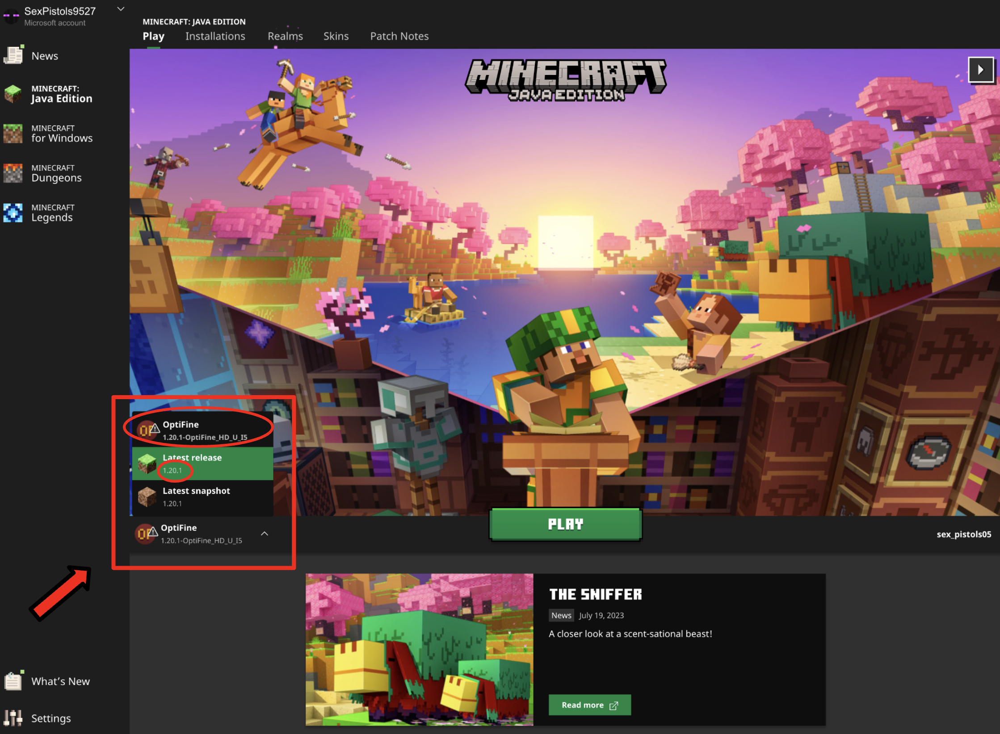
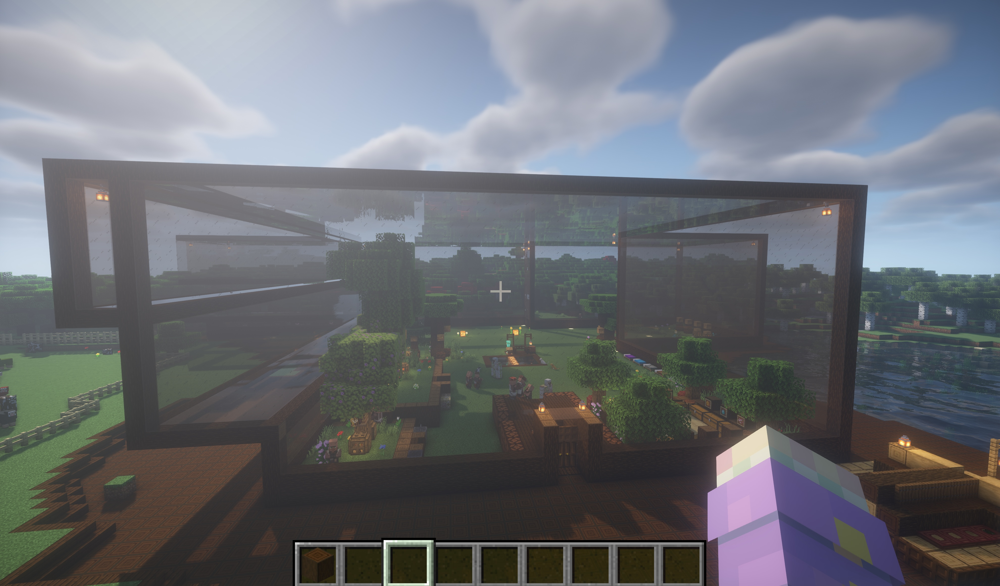
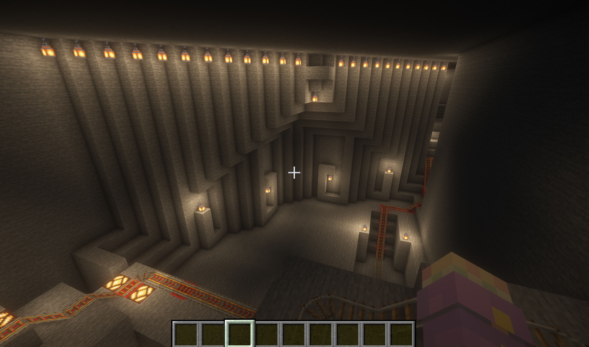
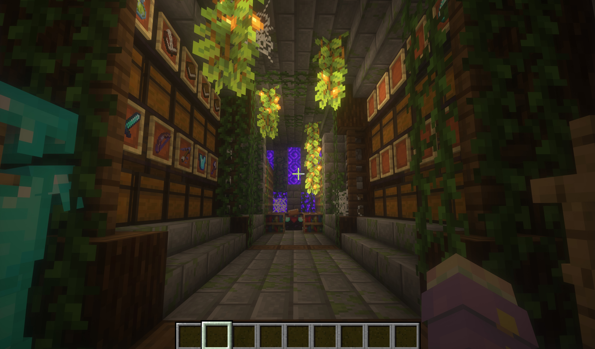
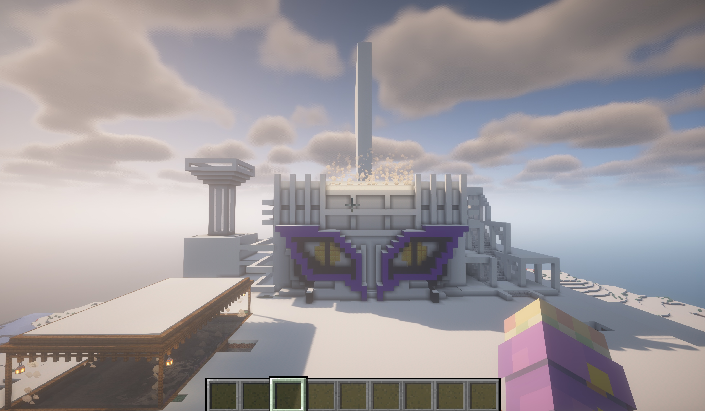
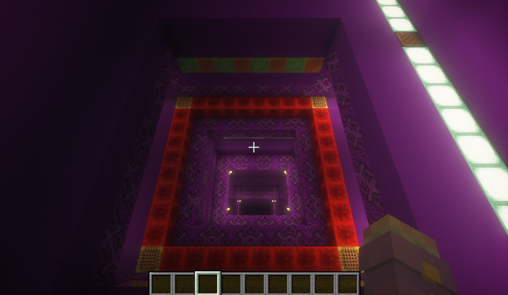
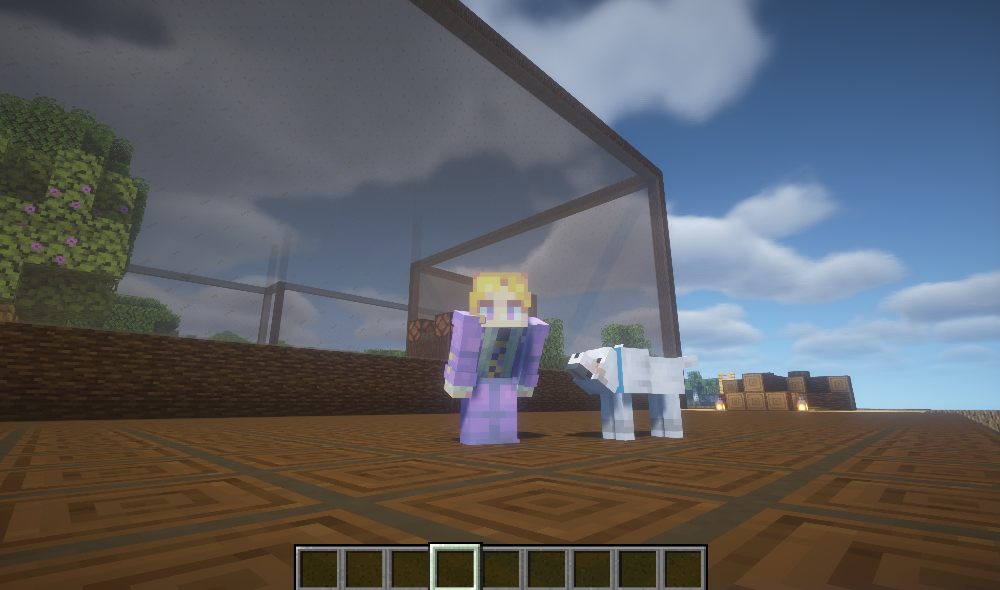

## To-Do 
- [ ] Combination of Auto-Farm (crop + honey + etc)
- [ ] clear out a space for Colosseum fighting area for user
- [ ] sugaer cane bamboo farm 
    - [design 1](https://www.youtube.com/watch?v=1LyQMfTpcHM)
    - [design 2](https://www.youtube.com/watch?v=WkB0EMz-gao)
- [ ] defense/attack Buildings
    - [resource](https://www.youtube.com/watch?v=g_AZLPo0CTo) 
    - [smile tnt eject](https://www.youtube.com/watch?v=iU08aFjUS2U)
- [ ] interesting redstone [builds](https://www.youtube.com/watch?v=DfB35EJnUbk)

## &#x237e; Shaders
**1) Download [Java](https://www.oracle.com/java/technologies/downloads/#jdk17-mac)**  
- *`Java 17` is required*
- *select `ARM64 DMG Installer` for macOS*
- *open and install -> if software is not identify:*
    - go to settings 
    - privacy & security
    - scroll down to find security pop-ups, to mannually release system block
    - remember to close the minecraft and its launcher during installing
 

**2) [OptiFine](https://optifine.net/downloads.php)** 
- *A `Mod` for customizaed minecraft blocks*  
    - click on (Mirror)
    - enter mirror page then click for download
- *the version of OptiFine must match the version of minecraft you are playing*
<!-- alignment problem -->
<!--  -->
<!-- 

 -->

 

**3) [Shader list](https://thebreakdown.xyz/top-5-shaders-packs-for-minecraft/#bsl-shaders)** 
- *actual files that customized minecraft blocks into different style*  
    - shader version not necessarily have to be compactible with minecraft version 100%, not like OptiFine
    - click into the shader pack, select [`BSL Shaders`](https://bitslablab.com/), click download, through CurseForge
    - shader file must be zipped, rezip it if macOS unzip after downloading, right click compress

**4) Minecraft UI**
- *select `OptiFine` enter minecraft at the launcher UI*
    - select option 
    - video setting 
    - shaders 
    - then click shaders folder 
    - drag the zip files to this folder 
    - click on one shaders if the shader option is working then it's working

## &#x232d; My Buildings 
**`+`** *GlassHouse: ByTheSea - Daylight (birth place around: -503 / 63 / -293)*  

**`+`** *Tunnel: ByTheSea*

**`+`** *Basement: ByTheSea - credit to this [video](https://www.youtube.com/watch?v=xSuCbKhaJ34&t=637s)*

**`+`** *Front: snowCastle - Daylight*  

**`+`** *Basement: snowCastle*  

**`+`** *Skin: Kira Yoshikage - Dog: Ben*  

## &#x232d; RedStone Prototype
{...}

## &#x25b9; Rules
{...}

## &#x25b9; Resource
- *[last one is interesting, can place a vaillager on top](https://www.youtube.com/watch?v=yHrYamVmdhc)*
